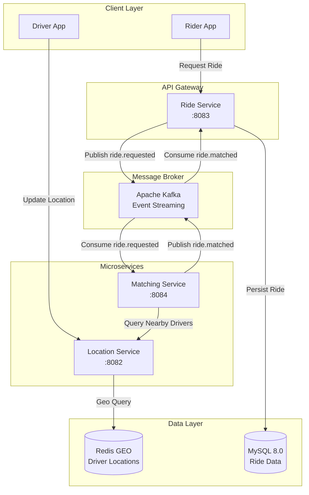
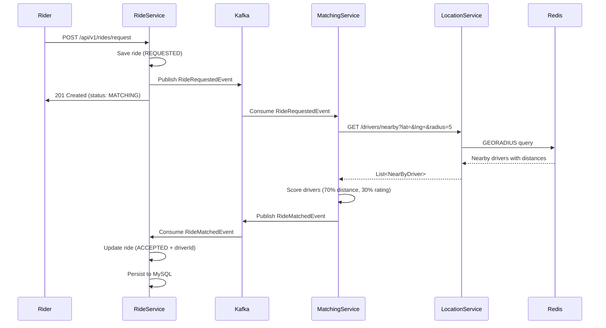
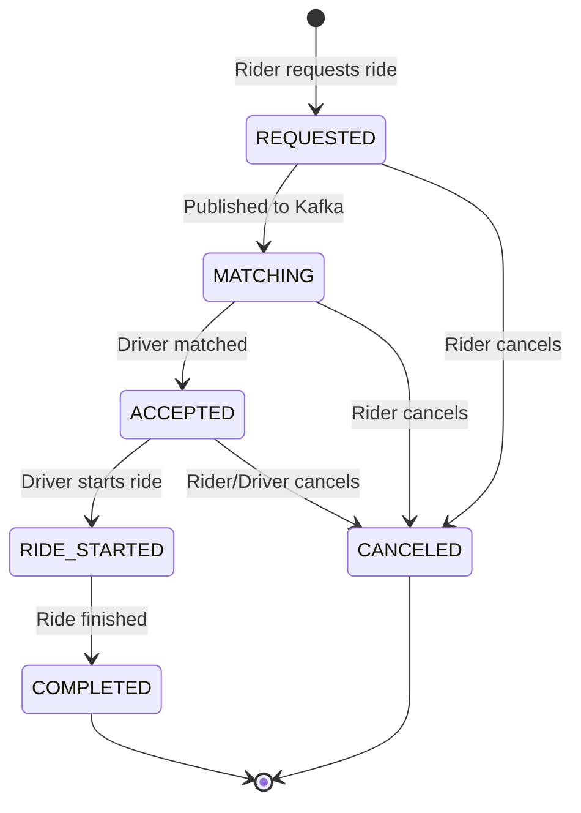

<div align="center">

# RideShare

### A Production-Grade Ride-Sharing Platform Built with Microservices Architecture

[](https://openjdk.org/projects/jdk/17/)
[](https://spring.io/projects/spring-boot)
[](https://spring.io/projects/spring-cloud)
[](https://kafka.apache.org/)
[](https://redis.io/)
[](https://www.mysql.com/)
[](https://www.docker.com/)
[](https://maven.apache.org/)

*A scalable, event-driven backend system demonstrating microservices patterns, real-time geospatial queries, and intelligent driver matching.*

---

</div>

## Overview

RideShare is a backend system for a ride-sharing platform (think Uber/Lyft) built as three independent microservices communicating through Apache Kafka. The system handles the complete ride lifecycle — from driver location tracking and intelligent matching to ride state management — using production-grade technologies and patterns.

**Key highlights:**
- **Real-time driver tracking** using Redis GEO commands for sub-millisecond geospatial queries
- **Event-driven architecture** using Kafka for asynchronous, decoupled service communication
- **Full ride lifecycle management** with a state machine enforcing valid transitions
- **Containerized infrastructure** with Docker Compose for one-command setup
- **Intelligent driver matching** with a weighted scoring algorithm (distance + rating)

---

## Architecture

### System Architecture



### Ride Request Flow



---

## Tech Stack

| Technology | Version | Purpose | Why Chosen |
|-----------|---------|---------|------------|
| **Java** | 17 | Language | LTS release, records, text blocks, pattern matching |
| **Spring Boot** | 4.1.0 | Application framework | Industry standard, convention over configuration |
| **Spring Cloud** | 2025.1.2 | Microservices tooling | OpenFeign for declarative HTTP clients |
| **Apache Kafka** | 7.4 | Event streaming | Decouples services, handles high throughput, replay capability |
| **Redis** | 7.x | Geospatial data store | Native GEO commands, O(log N) radius queries |
| **MySQL** | 8.0 | Relational data | ACID compliance for ride records, mature ecosystem |
| **Docker Compose** | 3.8 | Infrastructure | One-command startup, reproducible environments |
| **Lombok** | - | Boilerplate reduction | Cleaner entity/DTO classes |
| **Spring Data JPA** | - | ORM | Repository pattern, automatic schema management |
| **Spring Actuator** | - | Health monitoring | Production-ready health/info endpoints |

---

## Project Structure

```
Uber-App/
├── docker-compose.yml              # Infrastructure: Redis, MySQL, Kafka, Zookeeper
│
├── location-service/               # Driver location tracking
│   ├── src/main/java/com/rideshare/locationservice/
│   │   ├── config/
│   │   │   └── RedisConfig.java            # Redis connection configuration
│   │   ├── controller/
│   │   │   └── LocationController.java      # REST endpoints for location CRUD
│   │   ├── dto/
│   │   │   ├── DriverLocationRequest.java   # Inbound: driver location update
│   │   │   └── NearByDriverResponse.java    # Outbound: nearby driver with distance
│   │   └── service/
│   │       └── LocationService.java         # Redis GEO operations
│   └── src/main/resources/
│       └── application.properties           # Port 8082, Redis config
│
├── matching-service/               # Intelligent driver matching
│   ├── src/main/java/com/rideshare/matchingservice/
│   │   ├── client/
│   │   │   └── LocationServiceClient.java   # Feign client for Location Service
│   │   ├── dto/
│   │   │   └── NearByDriverResponse.java    # Mirror DTO for Feign deserialization
│   │   ├── event/
│   │   │   ├── RideRequestedEvent.java      # Inbound event from Ride Service
│   │   │   └── RideMatchedEvent.java        # Outbound event to Ride Service
│   │   └── service/
│   │       ├── MatchingService.java         # Core matching algorithm
│   │       └── RidesEventConsumer.java      # Kafka consumer for ride requests
│   └── src/main/resources/
│       └── application.yaml                 # Port 8084, Kafka + Feign config
│
└── ride-service/                   # Ride lifecycle management
    ├── src/main/java/com/rideshare/rideservice/
    │   ├── common/
    │   │   └── GlobalExceptionHandler.java  # Unified error handling
    │   ├── config/
    │   │   └── KafkaConfig.java             # Kafka topic definitions
    │   ├── controller/
    │   │   └── RideController.java          # REST endpoints for ride operations
    │   ├── dto/
    │   │   ├── RideRequest.java             # Inbound: ride request payload
    │   │   └── RideResponse.java            # Outbound: ride details
    │   ├── event/
    │   │   ├── RideRequestedEvent.java      # Outbound event to Matching Service
    │   │   └── RideMatchedEvent.java        # Inbound event from Matching Service
    │   ├── model/
    │   │   ├── Ride.java                    # JPA entity with audit fields
    │   │   └── RideStatus.java              # State machine enum
    │   ├── repository/
    │   │   └── RideRepository.java          # Spring Data JPA repository
    │   └── service/
    │       ├── RideService.java             # Core business logic + fare calculation
    │       └── RidesEventConsumer.java      # Kafka consumer for matched rides
    └── src/main/resources/
        └── application.yaml                 # Port 8083, MySQL + Kafka config
```

---

## Services Deep Dive

### Location Service (Port 8082)

The Location Service is the real-time geospatial engine of the system. It stores driver locations in Redis using GEO commands, enabling sub-millisecond proximity queries.

**Core responsibilities:**
- Accept driver location updates every 3 seconds (real-time GPS feed)
- Store locations using Redis `GEOADD` for geospatial indexing
- Query nearby drivers using Redis `GEORADIUS` with distance sorting
- Remove drivers when they go offline

**Why Redis GEO?**
Traditional databases require spatial indexing (R-trees, quadtrees) and still perform poorly at scale. Redis GEO uses Sorted Sets under the hood, providing O(log N) insertion and radius queries. For a ride-sharing app where driver positions update every 3 seconds across thousands of drivers, this is critical.

```java
// Redis GEO query — finds drivers within radius, sorted by distance
redisTemplate.opsForGeo().radius(
    DRIVER_GEO_KEY,
    new Circle(point, new Distance(5, Metrics.KILOMETERS)),
    GeoRadiusCommandArgs.newGeoRadiusArgs()
        .includeCoordinates()
        .includeDistance()
        .sortAscending()
        .limit(10)
);
```

---

### Matching Service (Port 8084)

The Matching Service is the brain of the system. It consumes ride requests from Kafka, queries nearby drivers, scores them using a weighted algorithm, and publishes the match result.

**Core responsibilities:**
- Consume `RideRequestedEvent` from Kafka
- Query Location Service for nearby drivers via OpenFeign
- Score and rank drivers using the matching algorithm
- Publish `RideMatchedEvent` to Kafka

**Why OpenFeign?**
Declarative HTTP clients eliminate boilerplate. Instead of writing RestTemplate calls, error handling, and URL construction, a simple interface with annotations handles everything:

```java
@FeignClient(name = "location-service", url = "${location.service.url}")
public interface LocationServiceClient {
    @GetMapping("/api/v1/locations/drivers/nearby")
    List<NearByDriverResponse> getNearByDrivers(
        @RequestParam double latitude,
        @RequestParam double longitude,
        @RequestParam double radius
    );
}
```

---

### Ride Service (Port 8083)

The Ride Service is the state manager. It persists ride records, manages the ride lifecycle through a state machine, and coordinates with the Matching Service via Kafka.

**Core responsibilities:**
- Accept ride requests and persist to MySQL
- Publish `RideRequestedEvent` to Kafka
- Consume `RideMatchedEvent` and update ride with assigned driver
- Enforce ride state transitions (REQUESTED → MATCHING → ACCEPTED → STARTED → COMPLETED)
- Calculate estimated fares using Haversine distance formula
- Global exception handling with proper HTTP status codes

**State Machine:**
```
REQUESTED → MATCHING → ACCEPTED → RIDE_STARTED → COMPLETED
    ↓           ↓          ↓
  CANCELED   CANCELED   CANCELED
```

Invalid transitions throw `IllegalArgumentException`, caught by the `GlobalExceptionHandler`.

---

## Matching Algorithm

The matching algorithm uses a weighted scoring system to select the optimal driver for each ride request.

### Formula

```
score = (1 / distance_km) × 0.7 + rating × 0.3
```

### Breakdown

| Component | Weight | Range | Rationale |
|-----------|--------|-------|-----------|
| **Distance** | 70% | 0.1–∞ km | Closer drivers arrive faster, better UX |
| **Rating** | 30% | 4.0–5.0 | Quality matters, but proximity is king |

### Why This Formula?

1. **Distance is primary (70%):** In ride-sharing, wait time is the #1 factor in user satisfaction. A 4.9-rated driver 8km away loses to a 4.1-rated driver 0.5km away every time.

2. **Rating is secondary (30%):** Prevents matching with consistently low-rated drivers while not over-prioritizing it. A 0.1 rating difference shouldn't override a 3km distance gap.

3. **Inverse distance scoring:** `1 / distance` naturally favors closer drivers with exponential preference. A driver 0.5km away scores 2x better than one 1km away.

4. **Division-by-zero guard:** `Math.max(distance, 0.1)` prevents Infinity scores when a driver is at the exact pickup location.

### Simulation Note

Rating is currently simulated (`4.0 + Math.random()`) since there's no Driver Service yet. In production, this would fetch from a ratings database.

---

## API Reference

### Location Service

| Method | Endpoint | Description | Request Body | Response |
|--------|----------|-------------|--------------|----------|
| `POST` | `/api/v1/locations/drivers/update` | Update driver location (called every 3s) | `DriverLocationRequest` | `"Driver location updated successfully"` |
| `GET` | `/api/v1/locations/drivers/nearby` | Find nearby drivers | Query: `lat`, `lng`, `radius` (default 5km) | `List<NearByDriverResponse>` |
| `DELETE` | `/api/v1/locations/drivers/{driverId}` | Remove driver (goes offline) | - | `"Driver removed successfully"` |

**DriverLocationRequest:**
```json
{
  "driverId": "driver-123",
  "latitude": 40.7128,
  "longitude": -74.0060
}
```

**NearByDriverResponse:**
```json
{
  "driverId": "driver-456",
  "latitude": 40.7138,
  "longitude": -74.0050,
  "distanceInKm": 0.15
}
```

---

### Matching Service

| Method | Endpoint | Description | Request Body | Response |
|--------|----------|-------------|--------------|----------|
| `POST` | `/api/v1/matching/rides/{rideId}/match` | Trigger matching for a ride | `RideRequestedEvent` | `RideMatchedEvent` |

> Note: Matching is primarily event-driven via Kafka. The REST endpoint exists for manual triggering during testing.

---

### Ride Service

| Method | Endpoint | Description | Request Body | Response |
|--------|----------|-------------|--------------|----------|
| `POST` | `/api/v1/rides/request` | Request a new ride | `RideRequest` | `RideResponse` (201) |
| `GET` | `/api/v1/rides/{rideId}` | Get ride by ID | - | `RideResponse` |
| `GET` | `/api/v1/rides/rider/{riderId}` | Get all rides by rider | - | `List<RideResponse>` |
| `PUT` | `/api/v1/rides/{rideId}/start` | Start a ride | - | `RideResponse` |
| `PUT` | `/api/v1/rides/{rideId}/complete` | Complete a ride | - | `RideResponse` |
| `PUT` | `/api/v1/rides/{rideId}/cancel` | Cancel a ride | - | `RideResponse` |

**RideRequest:**
```json
{
  "riderId": "rider-789",
  "pickupLatitude": 40.7128,
  "pickupLongitude": -74.0060,
  "pickupAddress": "123 Main St, New York, NY",
  "dropLatitude": 40.7580,
  "dropLongitude": -73.9855,
  "dropAddress": "Times Square, New York, NY"
}
```

**RideResponse:**
```json
{
  "id": "uuid-ride-123",
  "riderId": "rider-789",
  "driverId": "driver-456",
  "pickupLatitude": 40.7128,
  "pickupLongitude": -74.0060,
  "pickupAddress": "123 Main St, New York, NY",
  "dropLatitude": 40.7580,
  "dropLongitude": -73.9855,
  "dropAddress": "Times Square, New York, NY",
  "status": "ACCEPTED",
  "estimatedFare": 14.50,
  "actualFare": null,
  "createdAt": "2025-01-15T10:30:00",
  "updatedAt": "2025-01-15T10:30:05",
  "startedAt": null,
  "completedAt": null
}
```

---

## Quick Start

### Prerequisites

- Java 17+
- Maven 3.9+
- Docker & Docker Compose

### 1. Start Infrastructure

```bash
docker-compose up -d
```

This starts:
- Redis (port 6379) — driver location storage
- MySQL (port 3306) — ride data persistence
- Kafka (port 9092) — event streaming
- Zookeeper (port 2181) — Kafka coordination

### 2. Build All Services

```bash
# From root directory
cd location-service && mvn clean package -DskipTests && cd ..
cd matching-service && mvn clean package -DskipTests && cd ..
cd ride-service && mvn clean package -DskipTests && cd ..
```

### 3. Run Services (in separate terminals)

```bash
# Terminal 1
cd location-service && mvn spring-boot:run

# Terminal 2
cd matching-service && mvn spring-boot:run

# Terminal 3
cd ride-service && mvn spring-boot:run
```

### 4. Test the Flow

```bash
# Step 1: Add a driver location
curl -X POST http://localhost:8082/api/v1/locations/drivers/update \
  -H "Content-Type: application/json" \
  -d '{"driverId":"driver-1","latitude":40.7128,"longitude":-74.0060}'

# Step 2: Request a ride
curl -X POST http://localhost:8083/api/v1/rides/request \
  -H "Content-Type: application/json" \
  -d '{
    "riderId": "rider-1",
    "pickupLatitude": 40.7128,
    "pickupLongitude": -74.0060,
    "pickupAddress": "123 Main St",
    "dropLatitude": 40.7580,
    "dropLongitude": -73.9855,
    "dropAddress": "Times Square"
  }'

# Step 3: Check ride status (should show ACCEPTED with driverId)
curl http://localhost:8083/api/v1/rides/{ride-id}
```

---

## Ride Lifecycle



### State Transitions

| From | To | Trigger | Valid? |
|------|-----|---------|--------|
| `REQUESTED` | `MATCHING` | Kafka event published | ✅ |
| `REQUESTED` | `CANCELED` | Rider cancels | ✅ |
| `MATCHING` | `ACCEPTED` | Driver matched | ✅ |
| `MATCHING` | `CANCELED` | Rider cancels | ✅ |
| `ACCEPTED` | `RIDE_STARTED` | Driver starts | ✅ |
| `ACCEPTED` | `CANCELED` | Cancel | ✅ |
| `RIDE_STARTED` | `COMPLETED` | Driver completes | ✅ |
| `COMPLETED` | `*` | - | ❌ Terminal |
| `CANCELED` | `*` | - | ❌ Terminal |

---

## Infrastructure

### Docker Compose Services

| Service | Image | Port | Purpose |
|---------|-------|------|---------|
| Redis | `redis:latest` | 6379 | Geospatial driver location storage |
| MySQL | `mysql:8.0` | 3306 | Persistent ride data storage |
| Zookeeper | `confluentinc/cp-zookeeper:7.4.0` | 2181 | Kafka broker coordination |
| Kafka | `confluentinc/cp-kafka:7.4.0` | 9092 | Event streaming between services |

### Kafka Topics

| Topic | Producer | Consumer | Partitions | Purpose |
|-------|----------|----------|------------|---------|
| `ride.requested` | Ride Service | Matching Service | 3 | Ride request events |
| `ride.matched` | Matching Service | Ride Service | 3 | Driver match results |

---

## Future Improvements

| Area | Enhancement | Priority |
|------|-------------|----------|
| **Authentication** | JWT-based auth for rider/driver | High |
| **WebSocket** | Real-time ride status updates to clients | High |
| **Driver Service** | Separate service for driver profiles, ratings, documents | High |
| **Payment** | Stripe integration for fare processing | Medium |
| **Rate Limiting** | API throttling to prevent abuse | Medium |
| **Caching** | Cache frequent rider queries in Redis | Medium |
| **Monitoring** | Prometheus metrics + Grafana dashboards | Medium |
| **CI/CD** | GitHub Actions for automated testing and deployment | Low |
| **Testing** | Unit + integration tests for all services | Low |
| **API Gateway** | Spring Cloud Gateway for routing and auth | Low |